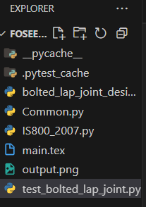
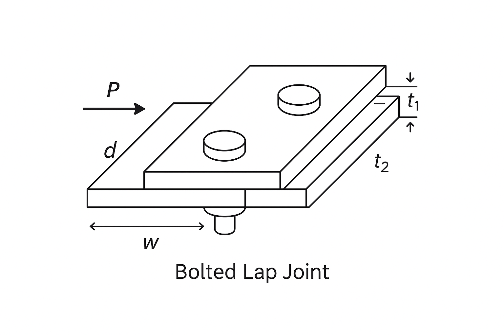

# FSF25_Unit-Testing-and-Report-Generation
FSF25_Unit Testing and Report Generation 
OSDAG (Open Steel Design and Graphics) PROJECT

# 🔩 Bolted Lap Joint Design as per IS 800:2007

This project automates the structural design of bolted lap joints using Python, based on the Indian Standard IS 800:2007.

## 📌 Project Overview

- Calculates the number of bolts required for lap joints under tension
- Considers shear and bearing strengths of bolts
- Selects optimal bolt diameter and grade
- Ensures connection efficiency and safety

## 📁 Files Included

- `main.tex` – LaTeX report for Overleaf (with flowcharts, formulas, and code)
  https://www.overleaf.com/read/pmfxvkwsqnth#ea1e3b
- `bolted_lap_joint_design.py` – Python script implementing the design logic
- `bolted_lap_joint_overleaf_project.zip` – Ready-to-upload Overleaf zip project
- `output.png` – Screenshot of sample Python output
- `file_structure.png` – File structure


## 🧮 File Structure



## 🧮 Output


## 📐 Bolted Lap Joint Diagram



## 💻 Python Code Snapshot

Below is an example snippet from the core design function:

```python
N_b = math.ceil(P_N / (V_b * 0.75))  # Required number of bolts
if N_b < 2:
    continue  # Minimum 2 bolts required

